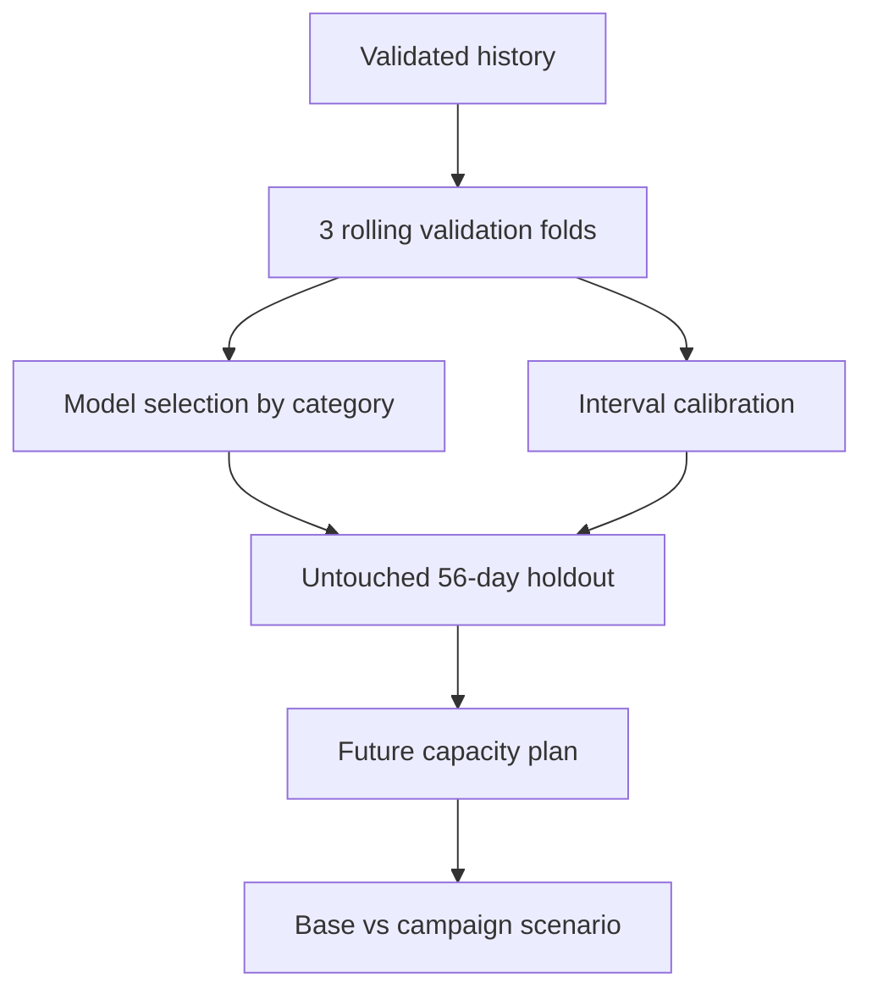

# Ecommerce Demand Forecasting

[](https://github.com/parisaMSTFV/ecommerce-demand-forecasting/actions/workflows/ci.yml)
[](https://www.python.org/)
[](DATA_PROVENANCE.md)

Capacity planning fails when a forecast is accurate on average but misses peaks
or leaks future commercial drivers. This project turns category-day demand into
an eight-week plan with rolling validation, an untouched holdout, calibrated
intervals and a guarded supplied-input path.

> **Evidence boundary:** every metric and chart committed to this repository
> comes from generated synthetic data. They do not establish performance on a
> real business dataset.

| Executed synthetic evidence | Result |
|---|---:|
| Rolling-validation WAPE | **5.0%** |
| Improvement vs seasonal naive | **33.6%** |
| Untouched 56-day holdout WAPE | **4.9%** |
| 80% interval coverage | **80.8%** |


Two modes are executable: the reproducible synthetic case study and a guarded
contract for a user's aggregate category-day history plus known-future drivers.
Supplied files are read in place, not copied into the output; their provenance
declarations are recorded but not independently verified.

```bash
# Published synthetic case study
demand-forecast run --output-dir local-runs/latest

# Your data; output directory must be new or empty
demand-forecast run-supplied --history-csv /secure/history.csv \
  --future-drivers-csv /secure/future_drivers.csv \
  --provenance-json /secure/provenance.json --output-dir /secure/forecast-output
```

See the exact schemas, validation rules and privacy boundary in the
[supplied-input contract](docs/supplied_input_contract.md).

## Business question

How many daily orders should an ecommerce operation prepare for during the next
56 days, and how should the plan change under a proposed campaign?

The pipeline:

- estimates unconstrained demand from orders and availability;
- compares three models through rolling-origin validation;
- selects a model independently for each category;
- evaluates the selected system on an untouched holdout;
- calibrates 80% empirical prediction intervals;
- reconciles category forecasts exactly to a daily total;
- translates uncertainty into a capacity risk buffer;
- separates a predictive campaign scenario from causal lift.

## Validated synthetic-demo results

The complete pipeline was run on 4,384 synthetic category-day records from
2023-01-01 through 2025-12-31.

| Result | Value |
|---|---:|
| Rolling-validation WAPE — driver-aware model | **5.0%** |
| Rolling-validation WAPE — seasonal naive | 7.6% |
| Relative WAPE improvement vs seasonal naive | **33.6%** |
| Untouched 56-day holdout WAPE | **4.9%** |
| Holdout signed bias | **+0.5%** |
| 80% interval coverage on holdout | **80.8%** |
| Proposed campaign scenario vs base | **+17,879 orders** |

The driver-aware ridge model won for all four categories in validation. That
outcome was produced by the run rather than imposed by the pipeline.

| Category | Holdout WAPE | Bias | Interval coverage |
|---|---:|---:|---:|
| Beauty | 4.6% | +0.1% | 82.1% |
| Electronics | 6.7% | +1.7% | 75.0% |
| Grocery | 3.9% | +0.1% | 83.9% |
| Home | 5.6% | +0.7% | 82.1% |


The proposed two-week campaign is applied only to Beauty and Home. The model
predicts approximately 9,029 additional Beauty orders and 8,850 additional Home
orders during the 56-day plan. This is a conditional forecast scenario, not a
causal incrementality estimate.


The daily upper planning bound peaks at 14,942 orders on 2026-01-02. The
decision note explains when the point forecast or upper bound is the more
appropriate capacity input.

## Evaluation design



The holdout is never used for model selection or interval calibration. Every lag
and rolling feature uses target values strictly before the prediction date.

## Models

| Model | Purpose |
|---|---|
| `seasonal_naive` | Repeat demand from seven days earlier |
| `seasonal_average` | Average the same weekday over four prior weeks |
| `driver_ridge` | Combine lagged demand, calendar, trend and known commercial drivers |

WAPE is the selection metric. MAE, signed bias and interval coverage are reported
as separate controls.

## Repository structure

```text
src/ecommerce_forecasting/   data, features, models, backtesting and reporting
tests/                       leakage, metrics, reconciliation and pipeline tests
docs/                        analysis plan, metric definitions and interview guide
reports/                     validated tables, charts and decision note
scripts/                     sensitive-content check
.github/workflows/           CI for Python 3.11 and 3.12
```

Generated row-level data is stored under `data/generated/` and excluded from Git.
Supplied raw files are never copied; local report outputs can still contain derived
category-day predictions and should be handled according to the source policy.

## Run locally

```bash
python -m venv .venv
source .venv/bin/activate
python -m pip install -e ".[dev]"
make run
make check
```

On Windows PowerShell, activate the environment with:

```powershell
.venv\Scripts\Activate.ps1
```

The full run writes reproducible outputs to the ignored `local-runs/latest/`
directory. The validated evidence published with the repository remains under
`reports/`.

To exercise both data paths without changing tracked reports:

```bash
make smoke
```

## Documentation

- [Analysis plan](docs/analysis_plan.md)
- [Metric dictionary](docs/metric_dictionary.md)
- [Modeling notes](docs/modeling_notes.md)
- [Interview guide](docs/interview_guide.md)
- [Data provenance](DATA_PROVENANCE.md)
- [Supplied-input contract](docs/supplied_input_contract.md)
- [Decision note](reports/decision_note.md)

## Limitations

- Availability adjustment is a simplified approximation of censored demand.
- Planned campaign and discount inputs must be known before the forecast is made.
- Residual intervals are empirical and do not guarantee conditional coverage.
- Summed category bounds are a planning range, not an exact total-demand interval.
- The campaign scenario is predictive; it does not estimate causal incrementality.
- Supplied-input provenance is declared by the user and is not independently verified.

## License

MIT
